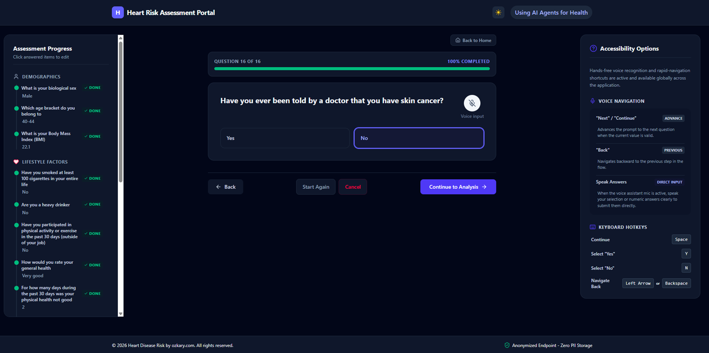

# Capstone Write-up: Heart Disease Risk Assessment Agent

## Overview

I chose to build this agent because I believe AI can make a tremendous impact on health management and risk assessment. In my experience, I have worked on similar projects where we spent months developing solutions with hardcoded decision trees, only to end up with low accuracy in their results.

With the power of Artificial Intelligence and SDK libraries like the Google Agent Development Kit (ADK), we can build smart solutions with higher accuracy in a fraction of the time. These libraries enable us to build agents with Model Context Protocol (MCP) tools, integrate with Large Language Models (LLMs), and manage session states to follow conversations naturally—very similar to a clinical patient onboarding process.

In addition, AI assistants like Antigravity are excellent productivity tools that allow us to adopt a specification-driven development approach. By providing the specification files in the form of markdown documents, we can vibe code with Antigravity to create an enterprise-level solution that addresses key concerns like accessibility, usability, security, and governance requirements to protect PII and medical history.

With Antigravity, we are not just coding the frontend components; we are also orchestrating the DevOps pipeline by implementing bash scripts that can be modified and re-run to continuously enhance our deployments. Leveraging my experience and knowledge of applications and cloud engineering, I can provide Antigravity with updates to the specifications, and the tool can review, recommend, and apply the code changes. This keeps the specifications perfectly aligned with the solution that is being delivered.

Now that we have some background about this project and the tools that we are using, let's continue with the problems this solves, our implementation approach, and the overall system architecture and components.

---

## What Problem It Solves

This project demonstrates how we can leverage medical profile information—such as demographics, lifestyle factors, and medical history—and utilize historical clinical data to provide a heart disease risk assessment. The goal is to detect underlying health patterns and help individuals identify lifestyle choices or habits they can change to reduce their cardiovascular risks.



---

## Vibe Coding - Specifications

Since we are using a vibe coding approach and want to iterate quickly, all the specifications are provided in the form of markdown documents. These documents are organized around specific areas of concern: data collection, accessibility, technical requirements, integrations, devops, governance, and the overall system blueprint. This modular structure provides a clear scope of work and details all specifications, enabling Antigravity to drill down into each specific area of the system.

Below is the list of specification files structured for their respective scope of work:

### Frontend App & Orchestration Specs (`/app/specs/`)
* **[solution-blueprint.md](./app/specs/solution-blueprint.md)**: Overall system blueprint.
* **[specs-collection-process.md](./app/specs/specs-collection-process.md)**: Conversational sequence specifications.
* **[specs-data-collection.md](./app/specs/specs-data-collection.md)**: Clinical feature questionnaire schema mappings.
* **[specs-devops.md](./app/specs/specs-devops.md)**: Deployment, scaling parameters, and service account configs.
* **[specs-server-agent.md](./app/specs/specs-server-agent.md)**: Google ADK State-Graph and LLM Analyst prompts.
* **[specs-server-routes.md](./app/specs/specs-server-routes.md)**: Proxy middleware and validation rules.
* **[specs-ui-accessibility.md](./app/specs/specs-ui-accessibility.md)**: Hotkeys and Voice Speech controls.
* **[specs-ui-technical.md](./app/specs/specs-ui-technical.md)**: Dynamic Dark Mode guidelines.
* **[specs-ui-timeline.md](./app/specs/specs-ui-timeline.md)**: Sidebar progress rail components.

### MCP Tool & Inference Specs (`/api/specs/`)
* **[solution-blueprint.md](./api/specs/solution-blueprint.md)**: Service interactions and API designs.
* **[specs-devops.md](./api/specs/specs-devops.md)**: Cloud Function configuration parameters.
* **[specs-mcp-server.md](./api/specs/specs-mcp-server.md)**: Model Context Protocol SSE and tool bindings.
* **[specs-risk-evaluation.md](./api/specs/specs-risk-evaluation.md)**: XGBoost feature preparation and threshold mappings.

This approach allows us to keep the conversation with Antigravity concise without losing track of the core specifications. We start with our baseline specs, and as changes are made or new features are discovered, we update the markdown documents. We then ask Antigravity to read the changes, review the code, and propose updates. This iterative approach makes our developer-agent relationship feel like peer programming with a colleague, while setting up solid guardrails so the solution strictly follows our design and governance rules.

---

## Architecture

This solution consists of the following main components:

* **Client-Side Agent**: Handles user data capture.
* **Server Proxy**: Manages security and authorization.
* **Server-Side Agent**: Orchestrates the MCP tools integration and clinical analysis.
* **MCP Tool & ML Inference Server**: Hosts a custom Machine Learning model trained on clinical data for heart risk evaluation.

This structure is designed to support an agile SDLC approach, allowing us to build modular components and continuously iterate to improve the solution.

### Solution Tree

Below is the directory tree of the entire solution, showing both the frontend application, the backend API, and their respective specification documents:

```
/heart-disease-risk-agent/
 ├── README.md                  # [This File] Capstone Project Write-up
 ├── local_run_plan.md          # Local execution guidelines
 ├── /app/                      # Frontend UI and Backend Server (Google ADK Orchestration)
 │    ├── package.json
 │    ├── deploy.sh             # Frontend Cloud Run deployment script
 │    ├── setup-sa.sh           # Service Account configuration script
 │    ├── Dockerfile            # Multi-stage container build configuration
 │    ├── server.ts             # Server entry point exposing /api/evaluate-risk
 │    ├── /specs/               # Frontend app and proxy specs
 │    │    ├── solution-blueprint.md
 │    │    ├── specs-collection-process.md
 │    │    ├── specs-data-collection.md
 │    │    ├── specs-devops.md
 │    │    ├── specs-server-agent.md
 │    │    ├── specs-server-routes.md
 │    │    ├── specs-ui-accessibility.md
 │    │    ├── specs-ui-technical.md
 │    │    └── specs-ui-timeline.md
 │    ├── /server/src/          # Backend Agent Code
 │    │    ├── /workflows/      # Pure orchestration workflows (heartRiskWorkflow.ts)
 │    │    ├── /agents/         # Analyst LLM Agent definitions (analystAgent.ts)
 │    │    └── /governance/     # Compliance & validation policy rules (compliance.ts)
 │    └── /src/                 # React App Frontend
 │         ├── App.tsx          # State coordinator
 │         ├── types.ts         # Core types and interfaces
 │         ├── /agent/          # Client-side agent metadata (data-agent.json, DataCollectionAgent.ts)
 │         └── /components/     # Modular view components (WelcomeScreen, QuestionCard, ResultsScreen, etc.)
 └── /api/                      # Machine Learning Inference & FastMCP SSE Tool Server
      ├── main.py               # Starlette ASGI app / WSGI Cloud Function handler
      ├── requirements.txt      # Python dependencies (fastmcp, xgboost, starlette)
      ├── deploy.sh             # Serverless Python Cloud Function deploy script
      ├── /specs/               # Python API & MCP specs
      │    ├── solution-blueprint.md
      │    ├── specs-devops.md
      │    ├── specs-mcp-server.md
      │    └── specs-risk-evaluation.md
      └── /predict/             # Inference model & vectorizer configurations (XGBoost)
           ├── hd_xgboost_model.pkl
           └── hd_dictvectorizer.pkl
```

---

## Component Details

### 1. Client-Side Agent & Data Capture
* A React + Vite application hosting a client-side metadata-driven agent ([DataCollectionAgent.ts](./app/src/agent/DataCollectionAgent.ts)) that governs the user onboarding flow.
* **Key Features**:
  * Accessibility features including browser-native speech recognition commands (Web Speech API) and keyboard hotkeys.
  * Native system Dark/Light mode theme toggle synced with local storage.
  * Streamlined step-by-step conversational interface that avoids chatbot fatigue by focusing on clean form input.
  * In-flight wellness tips to educate users while risk calculation takes place.

### 2. Server Proxy
* A Node.js backend route serving as the gateway to downstream AI models.
* Integrates with Google Cloud Identity-Aware Proxy (IAP) to verify identity tokens, sanitize incoming data, and block unauthorized requests.
* **DevOps Deployment**: The `app/deploy.sh` script automates the container compilation and deployment for both the React client SPA and this Node.js server proxy together as a single multi-stage container deployment on Google Cloud Run.

### 3. Server-Side Agent (Google ADK)
* Developed using the Google Agent Development Kit (ADK) to define structured agents ([analystAgent.ts](./app/server/src/agents/analystAgent.ts)) and connect to the Vertex AI and Gemini LLM platforms.
* Utilizes a pure orchestration graph workflow ([heartRiskWorkflow.ts](./app/server/src/workflows/heartRiskWorkflow.ts)) to parse inputs, query MCP tools, analyze statistical scoring matrices, and generate localized clinical review narratives.

### 4. MCP Inference Tool Server
* A Python 3.12 server using the FastMCP framework to expose the model as an MCP tool (`evaluate_heart_risk`).
* Hosts a custom Machine Learning model created by me (see my GitHub profile: [@ozkary](https://github.com/ozkary)). It loads model weights (`hd_xgboost_model.pkl`) and data transformers (`hd_dictvectorizer.pkl`) into memory and executes a statistical XGBoost inference pipeline to return numerical risk probabilities and classifications.

---

## Cloud Infrastructure

The production solution is deployed entirely on Google Cloud Platform (GCP) using serverless infrastructure to ensure cost-efficiency and security:

1. **Google Cloud Run**: Hosts the containerized Node/React application (`heart-disease-risk-ui`) in the `us-east1` region. Configured with strict scale-to-zero settings (`--min-instances=0`) for budget protection.
2. **Google Cloud Functions (Gen 2)**: Hosts the Python API and MCP Tool Server (`heart-disease-risk-assessment`). It runs on the serverless HTTP Python runtime, isolating model execution.
3. **Identity-Aware Proxy (IAP)**: Sits in front of the frontend, securing user access and ensuring that only authenticated personnel can submit profiles.
4. **Google Vertex AI**: Serves as the Gemini 2.5 Flash foundation model provider, powering the clinical reviewer agent that converts XGBoost statistics into human-friendly medical guidance.
5. **IAM (Identity & Access Management)**: Employs a dedicated runtime Service Account with fine-grained invoker permissions (`roles/run.invoker`) to secure communication channels between the UI Proxy and the Inference Cloud Function.

---

## Summary & Key Takeaways

Building the Heart Disease Risk Assessment Agent has demonstrated the immense power of combining modern machine learning models with agentic orchestration frameworks like the Google ADK. By offloading complex clinical evaluation state graphs to the backend and implementing a clean, accessible interface with real-time Speech-to-Text inputs on the frontend, this project delivers a highly secure, serverless application ready for real-world scenarios under HIPAA and governance policies. The integration of local model vectors via MCP SSE servers guarantees decoupled, scalable performance.

### Star & Follow ⭐
If you find this project helpful or want to follow my journey building robust cloud solutions and AI agent engineering, please consider **starring this repository** and following me on GitHub!

---

## Let's Connect

|  | **Oscar D. Garcia - Ozkary** <br> *Principlal Engineer \| 5-Consecutive Microsoft MVP \| GDG Community Lead* <br><br> Oscar Garcia is a Principal Software Architect specializing in building robust, serverless cloud solutions using GCP, Azure, and AWS. He is passionate about Artificial Intelligence and software engineering patterns. |
| :--- | :--- |
| **Social Links** | [Blog (ozkary.com)](https://www.ozkary.com) \| [Developer Journal (ozkary.dev)](https://www.ozkary.dev/) \| [GitHub (@ozkary)](https://github.com/ozkary) \| [Twitter (@ozkary)](https://twitter.com/ozkary) \| [YouTube (@ozkary)](https://www.youtube.com/@ozkary) |
