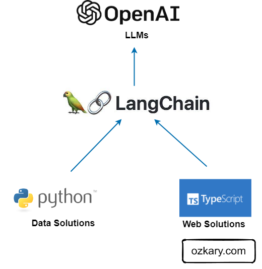

# Introduction

 Large Language Model (LLM) refers to a class of AI models that are designed to understand and generate human-like text based on large amounts of training data. The training process for LLMs typically involves unsupervised learning, where the model learns to predict the next word in a sentence based on the preceding words. This process helps the model capture statistical patterns and learn the relationships between words and phrases in the training data.
 
 

### Anouncement and Updates

- Join this list to receive updates on new content about Data Engineering  [Sign up here](https://maven.com/forms/56ae79)  
- Follow us on [Twitter](https://twitter.com/ozkary)  

## What can this repo help with?

The focus of this code repository is to cover the features of LLM and how they can be leveraged for a real use cases using the LangChain and OpenAI frameworks. The format of the code in this repo is implmented in a way that can enable develpers to gradually learn how to use this technology for building Python and Web applications.

By using LangChain's modular abstractions, we can orchestrate conversational pipelines thus reducing the amount of code needed for each step. Using LangChain accelerates our development process.
