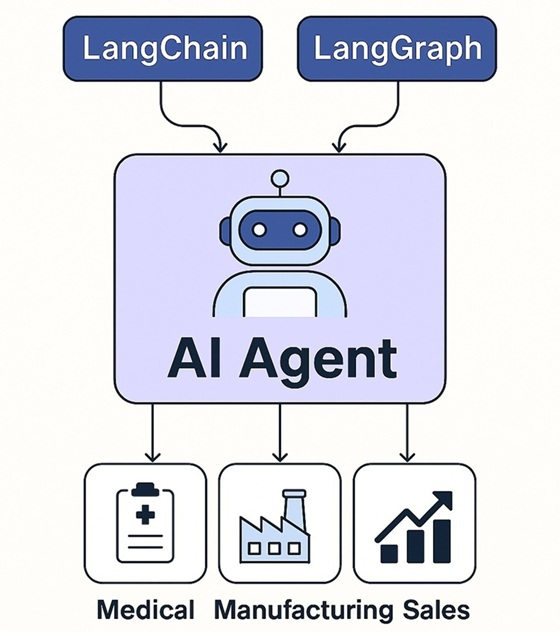

# Introduction

 Large Language Model (LLM) refers to a class of AI models that are designed to understand and generate human-like text based on large amounts of training data. The training process for LLMs typically involves unsupervised learning, where the model learns to predict the next word in a sentence based on the preceding words. This process helps the model capture statistical patterns and learn the relationships between words and phrases in the training data.
 
 

### Announcement and Updates

- Join this list to receive updates on new content about Data Engineering  [Sign up here](https://maven.com/forms/56ae79)  
- Follow us on [Twitter](https://twitter.com/ozkary)  

## What can this repo help with?

The focus of this code repository is to cover the features of LLM and how they can be leveraged for a real use cases using the LangChain and OpenAI frameworks. The format of the code in this repo is implemented in a way that can enable developers to gradually learn how to use this technology for building Python and Web applications.

By using LangChain's modular abstractions, we can orchestrate conversational pipelines thus reducing the amount of code needed for each step. Using LangChain accelerates our development process.

## AI Agents

Autonomous AI Agents are systems capable of performing complex tasks with minimal human oversight by dynamically reasoning, planning, and interacting with their environment. These agents leverage Large Language Models (LLMs) as their core reasoning engine and are enhanced by frameworks like LangChain and LangGraph to orchestrate modular, multi-step workflows.

By integrating memory architectures, agents can recall past interactions, maintain state, and adapt their behavior over time—transforming them from reactive tools into contextually aware collaborators. Furthermore, applying Model Context Protocol (MCP) ensures structured, interoperable communication between tools, agents, and data sources. MCP provides a consistent schema for prompt management, action routing, and memory referencing.

- [Data Analysis](./ai-agents/manufacturing/): This project demonstrates how to build a lightweight AI-powered agent using **LangChain**, **LangGraph**, **Generative AI** to analyze manufacturing sensor data.

## Use Cases with AI

Developers can leverage AI for various use cases, including:

- [Code Generation](./use_cases/code_generation/): AI models can generate code snippets or even complete functions based on provided prompts or user requirements. This can assist developers in automating repetitive coding tasks, exploring code possibilities, or providing code suggestions.

- [Smart Charts with AI-Powered Analysis](./use_cases/smart_charts/):Smart Charts are revolutionizing data visualization by integrating AI-powered analysis. Beyond just plotting points, AI models can examine charts and their source data, identifying patterns, correlations, and potential issues you might miss. This deeper understanding unlocks a new level of insight and allows for more impactful data storytelling.

> Coming soon

- Virtual Assistants and Chat bots: OpenAI models can be used to develop conversational agents, virtual assistants, or chat bots that can understand and respond to user queries in natural language. This enables developers to build interactive applications and provide automated support to users.
- Data Analysis and Predictive Modeling: With OpenAI models, developers can perform data analysis tasks, extract insights from large datasets, and develop predictive models. These models can be trained to understand patterns, make predictions, and assist with decision-making processes.
- Language Translation: OpenAI models can be used for language translation tasks, allowing developers to build applications that can translate text between different languages.
- Natural Language Processing (NLP): OpenAI models can perform a range of NLP tasks such as text generation, sentiment analysis, language translation, summarization, chatbot development, and more. Developers can integrate these capabilities into their applications to automate text-related tasks and enhance user experiences.

### Prompt Engineering

Prompt engineering is the process of designing and optimizing prompts to better utilize LLMs. Well described prompts can help the AI models better understand the context and generate more accurate responses. It is also helpful to provide some labels or expected results as examples, as this help the AI models evaluate its responses and provide more accurate results.

## Governance and Compliance

- AI governance refers to the set of policies, processes, and frameworks that organizations establish to guide the development, deployment, and use of AI technologies. It involves defining ethical principles, standards, and best practices to ensure responsible and accountable AI practices within an organization.

- AI compliance, on the other hand, refers to adherence to external regulations, laws, and industry standards governing the use of AI technologies. It involves ensuring that AI systems and processes comply with legal requirements, such as data protection regulations (e.g., GDPR), industry-specific guidelines, and ethical frameworks. 