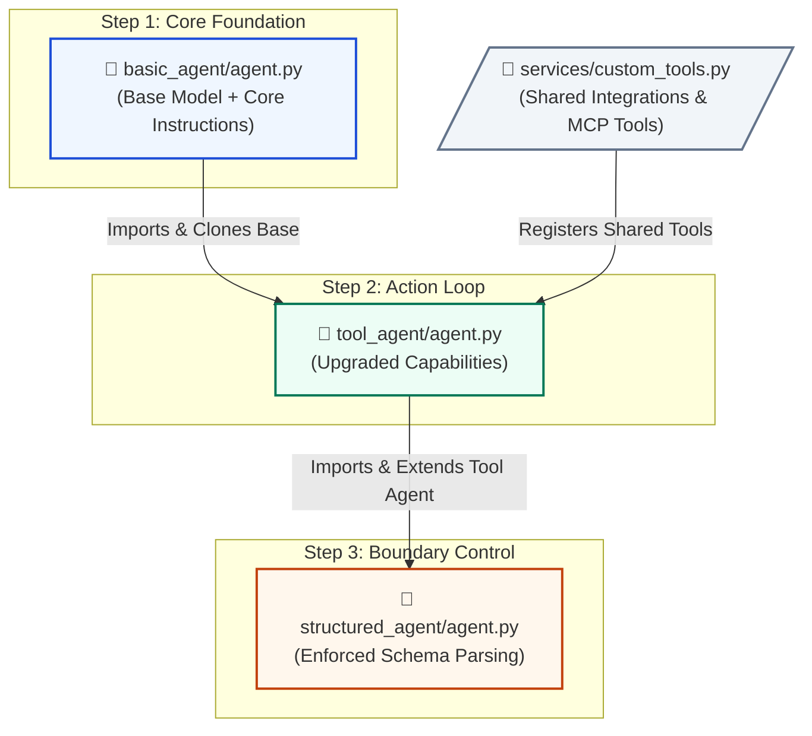

# AI Agents with Google ADK: Technical Bootstrap Blueprint

Welcome to the foundational training ground for the Google Agent Development Kit (ADK). If you have ever looked at production-grade agentic frameworks and felt overwhelmed by massive abstractions, complex multi-agent synchronization code, or brittle state loops, this project is designed for you. 

This repository provides a **shallow-curve, step-by-step curriculum** focused on building confidence with intelligent software systems using the native **Google ADK**. 

---

## 🧭 Educational Philosophy: Progressive Evolution & True Reusability

Our core mission is to introduce you to the Google ADK starting with its absolute **basic core concepts** and progressively improving your agents' capabilities line by line.

A major flaw in many Python-based AI tutorials is that they treat agents as throwaway scripts, leading to massive code duplication. This project rejects that pattern by focusing heavily on **Software Engineering Reusability**. 

Instead of rewriting an agent from scratch at every step, this bootcamp uses a **sequential inheritance pipeline** modeled directly below:



By leveraging Python's module system alongside the Google ADK's fluid configuration layer, you will see exactly how to build enterprise-ready agents that are modular, extensible, and completely DRY (Don't Repeat Yourself).

## Project Architecture

This workspace consolidates its package management at the root level while keeping individual agent directories self-contained with their own isolated local runtime parameters.

```
adk/
├── Pipfile                   # Centralized package dependency manifest for the SDK
│
├── tools/                    # SHARED INTEGRATIONS ENGINE and TOOLS
│   ├── __init__.py           # Exposes reusable business logic
│   └── custom_tools.py       # Centralized @mcp.tool or FunctionTool definitions
│
├── basic_agent/              # STEP 1: Core Fundamentals (Model + Instructions)
│   ├── __init__.py           # Exports basic_agent as the active 'agent'
│   ├── .env                  # Sandbox environment keys & credentials
│   └── agent.py              # Baseline intelligence wrapper
│
├── tool_agent/               # STEP 2: The Action Loop (Action & Interaction)
│   ├── __init__.py           # Exports tool_agent as the active 'agent'
│   ├── .env                  # Sandbox environment keys & credentials
│   └── agent.py              # IMPORTS basic_agent & attaches services.custom_tools
│
└── structured_agent/         # STEP 3: Boundary Control (Schema & Determinism)
    ├── __init__.py           # Exports structured_agent as the active 'agent'
    ├── .env                  # Sandbox environment keys & credentials
    └── agent.py              # IMPORTS tool_agent & enforces strict Pydantic parsing
```

## 🛠️ Environment Setup & Centralized Installation

To eliminate dependency version conflicts, the entire workspace runtime footprint is isolated within a single centralized virtual environment using pipenv inside the adk/ root.

Prerequisites
Ensure you have Python 3.12+ and pipenv installed globally on your workstation:

```bash
pip install pipenv

# clone the repo
git clone [https://github.com/ozkary/ai-engineering.git](https://github.com/ozkary/ai-engineering.git)
cd ai-engineering/adk

# install the dependencies
pipenv install

# Populate the local .env files within each agent sandbox directory to safely map your Google Cloud credentials
GOOGLE_APPLICATION_CREDENTIALS="/path/to/your/gcp-service-account.json"
GOOGLE_CLOUD_PROJECT="your-gcp-project-id"

# activate the shell workspace
pipenv shell
```
## Launching the Interactive Developer UI (adk web)

## 📡 Launching the Interactive Developer UI

Because the ADK CLI runs inside an isolated virtual environment, execute the workspace server using Python's module flag (`-m`) to ensure the shell can resolve the executable path:

```bash
# To launch and demonstrate the basic core concepts (Step 1):
adk web --target basic_agent/

# To transition and show the tool-equipped agent (Step 2):
adk web --target tool_agent/
```
Open the resulting local network loopback link printed in your terminal window (typically http://localhost:8000) to interact with your progressively evolving agent live!