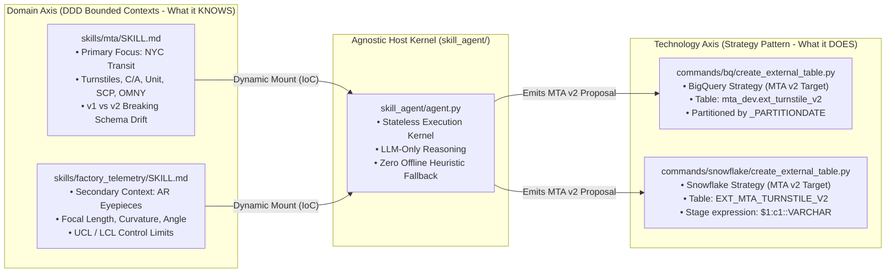
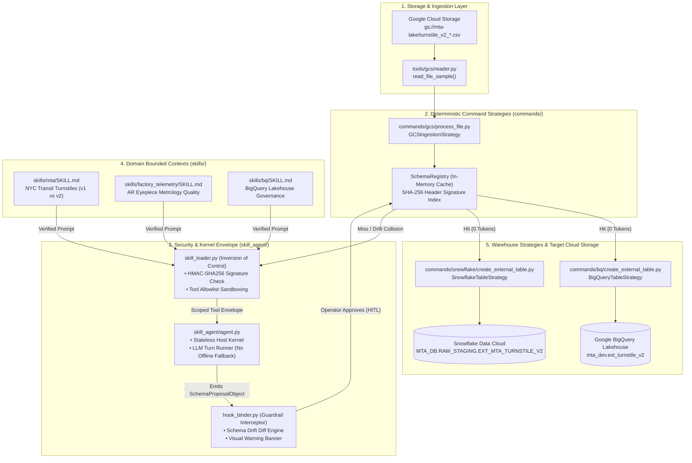
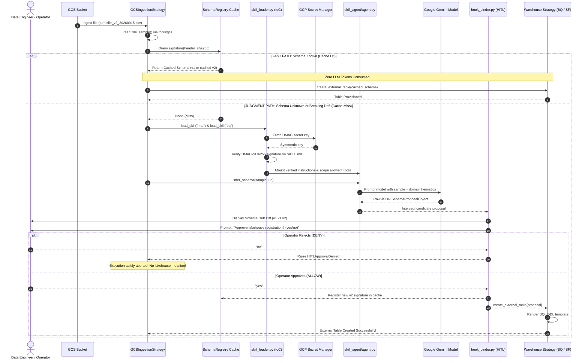
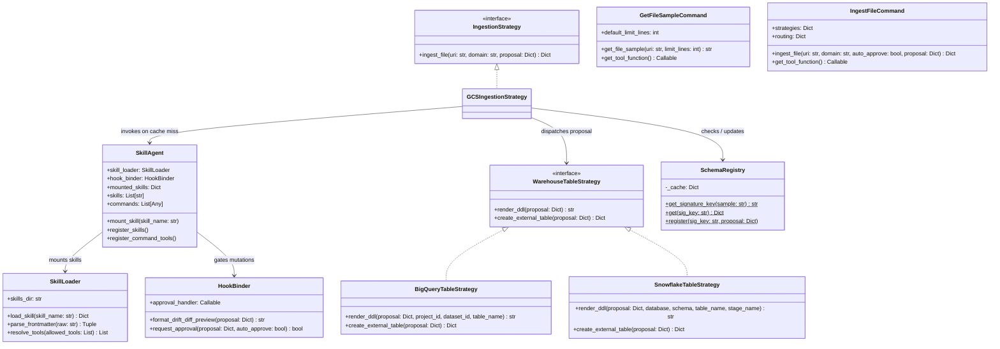

# Beyond the Persona: Modular Skill Agent Architecture & Implementation Plan
## Domain-Driven Design (DDD) & Strategy Pattern Specification

> [!IMPORTANT]
> **HITL Review Document**: This plan specifies the refactored **Skill Agent** architecture adhering to Domain-Driven Design (DDD) for domain skills, the Strategy Pattern for technology-specific commands, and an agnostic kernel hosted directly in [`skill_agent/`](adk/skill_agent).


- In our architecture, we extend agents using inheritance. The skill agent needs the use of tools from GCS and BQ as well as the security features. These tools as well as pretooluse hooks are already established. We need to extend the `secured_agent` with the `skill_agent`, which incorporates the concepts of skills and commands.
- The skills are based on DDD, so instead of just creating a generic data analysis, we create a domain specific skill like mta, factory_telemetry
- The commands orchestrate the skills and the use of tools. They use a strategy pattern to determine what tools to use based on the target data warehouse technology, i.e.  BiqQuery, SnowFlake
- There should be no custom implementation of client instances to connect to databases. We MUST always use the MCP tools. The GCS MCP toolset is a custom implementation as there is no official MCP from google.
- For MCP toolset for SnowFlake, we must just create a stub indicating it is not yet implemented
- For the scope of this agent, we are using the MTA dataset v1, and v2 schema versions to illustrate how the data pipelines can be extended with the use of AI.

---

## How are skill and commands connected to agents

- A command is registered on the agent as a tool. That's it. There's no new ADK wiring — a command is a FunctionTool whose implementation happens to be deterministic Python instead of an MCP call.
- That docstring is the command's documentation — the agent sees it, and there's nothing to keep in sync.

```text
Agent (skill_agent extends secured_agent)
├── tools = [ ...GCS MCP, BQ MCP, security tools..., get_file_sample, ingest_file ]  ← Commands live here as tools
├── skills = [ mta/SKILL.md, bq/SKILL.md ]                                           ← Mounted via constructor IoC
└── before_tool_callback = guardrail_pre_tool_hook, bigquery_mcp_hook                ← Inherited from SecuredToolAgent
```
- Flow: the LLM decides when to call ingest_mta_file (judgment). Once called, the command executes deterministically — checks the fingerprint registry, picks the warehouse strategy, calls the MCP toolset. The hooks still fire on those inner MCP calls because they're bound at the agent level, not per-command.

We extend the agent with skills and commands collections similar to the tools concept of ADK. The skills and commands are appended to the governance instructions. The commands are added as additional tools.

```python
class SkillAgent(SecuredAgent):
    def __init__(self, skills, commands, **kw):
        self.skills, self.commands = skills, commands
        super().__init__(**kwargs)

        # append the skills
        register_skills():        
        # append the commands as tools
        register_command_tools():        
        
```

- Where the strategy pattern sits: inside the command, not the agent.

Target selection is configuration, not judgment — so it belongs in neither the skill nor the command logic. The LLM should never pick a warehouse; that's a deployment/governance decision with a right answer that doesn't change per file.

Why not an env var: it works, but it's invisible to the agent, unauditable, and can't express fan-out or per-domain differences. You'd need MTA_TARGET=bigquery,snowflake string-parsing and you've lost the ability to hook it.

Declarative Routing

```yml
# config/routing.yaml
domains:
  mta:
    targets: [bigquery, snowflake]      # fan-out
    primary: bigquery
  factory_telemetry:
    targets: [snowflake]
```

The command resolves it — no reasoning involved:

```python
class IngestCommand:
    def run(self, uri, domain):
        schema = resolve_schema(uri, domain)
        routes = routing[domain]["targets"]
        return [self.strategies[t].create_table(schema) for t in routes]  # fan-out
```

- So: `agent → command (tool) → strategy → MCP toolset → hook`. The agent never knows which warehouse it's talking to; the command never knows how to reason about a schema; the skill never executes anything.

**Where each layer sits**

- What does this file mean?	Skill (judgment)
- Where does this domain land?	routing.yaml (config)
- How do I talk to that warehouse?	Strategy (implementation)
- Am I allowed to write there?	Hook (enforcement)

**The governance angle worth keeping**

Because the target list is declarative, your hook can validate it: a PreToolUse check that the resolved target is in an allowlist for that domain. An env var typo silently routes MTA to prod Snowflake; a config file with a hook check refuses it. That's the argument for config over env var in one line.

For the demo, ship MTA with [bigquery] only and mention fan-out as a config change — one line edited, zero code touched. That's your "extendable without touching the core engine" claim made concrete on stage.

---

## 1. Executive Summary & Core Design Tenets

Modern data platforms cannot rely on monolithic agent personas that attempt to bundle identity, procedures, file format rules, SQL standards, and security policies into a single instructions file. In production pipelines:

- **Skills teach what the agent knows** (domain intelligence, schema drift heuristics, governance rules). Skills **never** write or execute raw executable code; they emit structured JSON proposals.
- **Commands execute deterministic workflows** (file detection, DDL rendering, catalog updates). Commands run predictable steps without LLM token waste.
- **The Agent is an Agnostic Kernel**: Hosted in [`skill_agent/`](adk/skill_agent), it carries **no static persona or domain knowledge**. It dynamically mounts [`skills/mta/SKILL.md`](adk/skills/mta/SKILL.md) for transit data or [`skills/factory_telemetry/SKILL.md`](adk/skills/factory_telemetry/SKILL.md) for factory data.
- **No Offline Heuristic Fallbacks**: To avoid dual-engine maintenance drift, the Skill Agent delegates semantic reasoning strictly to the LLM. If the model is unreachable, execution halts immediately with an explicit failover message.
- **MTA v2 Dataset as the Primary Demo Focus**: Both **BigQuery** ([`commands/bq/create_external_table.py`](adk/commands/bq/create_external_table.py)) and **Snowflake** ([`commands/snowflake/create_external_table.py`](adk/commands/snowflake/create_external_table.py)) execute against **v2 of the MTA dataset**, proving that multiple warehouse strategies can consume the exact same schema contract without code changes.
- **Human-in-the-Loop (HITL) Gate**: Deterministic interceptors in [`skill_agent/hook_binder.py`](adk/skill_agent/hook_binder.py) halt execution before any storage or warehouse mutation occurs, displaying a visual schema drift diff (v1 vs v2) for operator sign-off.

---

## 2. Orthogonal Design Patterns: DDD (Domain) vs. Strategy (Technology)

The architecture isolates the **Domain Axis** from the **Technology Axis**:

```mermaid
flowchart LR
    subgraph DomainAxis ["Domain Axis (DDD Bounded Contexts - What it KNOWS)"]
        MTA["skills/mta/SKILL.md<br/>• Primary Focus: NYC Transit<br/>• Turnstiles, C/A, Unit, SCP, OMNY<br/>• v1 vs v2 Breaking Schema Drift"]
        Factory["skills/factory_telemetry/SKILL.md<br/>• Secondary Context: AR Eyepieces<br/>• Focal Length, Curvature, Angle<br/>• UCL / LCL Control Limits"]
    end

    subgraph AgnosticKernel ["Agnostic Host Kernel (skill_agent/)"]
        Agent["skill_agent/agent.py<br/>• Stateless Execution Kernel<br/>• LLM-Only Reasoning<br/>• Inversion of Control (IoC) Loader"]
    end

    subgraph ProposalBoundary ["Contract Boundary"]
        Proposal["Structured Schema Proposal (JSON)<br/>• Standardized Columns & Types<br/>• Partition & Clustering Directives<br/>• Zero DDL / Pure Data Contract"]
    end

    subgraph TechAxis ["Technology Axis (Strategy Pattern - What it DOES)"]
        BQ_Cmd["commands/bq/create_external_table.py<br/>• BigQuery Strategy (MTA v2 Target)<br/>• Table: mta_dev.ext_turnstile_v2<br/>• Partitioned by _PARTITIONDATE"]
        SF_Cmd["commands/snowflake/create_external_table.py<br/>• Snowflake Strategy (MTA v2 Target)<br/>• Table: EXT_MTA_TURNSTILE_V2<br/>• Stage expression: $1:c1::VARCHAR"]
    end

    subgraph ToolLayer ["Model Context Protocol (MCP) Tools"]
        BQ_MCP["mcp_servers/bq_server<br/>• tools/execute_ddl<br/>• Validates & runs BigQuery SQL"]
        SF_MCP["mcp_servers/snowflake_server<br/>• tools/execute_ddl<br/>• Validates & runs Snowflake SQL"]
    end

    subgraph TargetDW ["Target Data Warehouses"]
        BQ_DW[("Google BigQuery<br/>mta_dev.ext_turnstile_v2")]
        SF_DW[("Snowflake Data Cloud<br/>EXT_MTA_TURNSTILE_V2")]
    end

    MTA -->|"Dynamic Mount (IoC)"| Agent
    Factory -.->|"Dynamic Mount (IoC)"| Agent
    Agent -->|"Emits MTA v2 Proposal"| Proposal
    Proposal -->|"Injected into DDL Template"| BQ_Cmd
    Proposal -->|"Injected into DDL Template"| SF_Cmd
    BQ_Cmd -->|"Calls Tool via MCP"| BQ_MCP
    SF_Cmd -->|"Calls Tool via MCP"| SF_MCP
    BQ_MCP -->|"Provisions Table"| BQ_DW
    SF_MCP -->|"Provisions Table"| SF_DW
```





### 2.1 Domain-Driven Design (DDD) for Skills

Domain intelligence is modeled as isolated **Bounded Contexts**:

#### 1. Transit Domain Bounded Context — Primary Focus ([`skills/mta/SKILL.md`](adk/skills/mta/SKILL.md))
- **Ubiquitous Language**: Control Area (`C/A`), Sub-unit Control Panel (`SCP`), Remote Unit (`UNIT`), Station, Line Name, Division, Cumulative Turnstile Registers vs. Modernized OMNY Tap Payloads.
- **The Demo Conflict (Schema Drift)**:
  - **Baseline Contract (v1)**: Legacy turnstile feed (`YYMMDD.csv.gz`) containing 11 separate columns with fragmented `DATE` (`MM/DD/YYYY`) and `TIME` (`HH:MM:SS`) text columns, plus cumulative mechanical register counters.
  - **Conflicting Feed (v2)**: Modernized turnstile telemetry payload with consolidated `reading_timestamp` (epoch / ISO-8601), normalized IDs (`booth_id`, `station_id`), new dimensions (`fare_method`, `device_status`), and incremental counts.
- **Drift Heuristics**: Detects the version mismatch, flags breaking column removals, and maps target types.

#### 2. Factory Telemetry Bounded Context — Secondary Example ([`skills/factory_telemetry/SKILL.md`](adk/skills/factory_telemetry/SKILL.md))
- **Source Context**: Inspired by AR optical eyepiece manufacturing metrology ([`eye_piece.py`](file:///home/ozkary/workspace/chat-gpt/python/smart_charts/eye_piece.py)).
- **Ubiquitous Language**: Workpiece Serial (`Sample_ID`), Station Exit Timestamp (`Timestamp`), Optical Focal Length (`Focal_Length`), Laser Interferometer Curvature (`Curvature`), Prismatic Alignment Angle (`Angle`), Optical Clarity MTF Score (`Clarity`), Aberration Distortion Factor (`Distortion`), Coating Durability (`Durability`).

#### 3. Governance Bounded Context ([`skills/bq/SKILL.md`](adk/skills/bq/SKILL.md))
- Enforces BigQuery lakehouse compliance: mandatory date partitioning (`_PARTITIONDATE`), 730-day retention policies, `snake_case` table naming conventions, and lineage audit fields (`_ingested_at`, `_source_uri`).

---

### 2.2 Strategy Pattern for Technology-Specific Commands

Commands handle deterministic orchestration and are strictly decoupled by target infrastructure:

- **Base Strategy Interface ([`commands/base.py`](adk/commands/base.py))**:
  - `IngestionStrategy`: Defines contract for storage monitoring, registry cache checks, and conditional skill dispatch.
  - `WarehouseTableStrategy`: Defines contract for DDL rendering and table provisioning across analytical warehouses.
- **Storage Strategy ([`commands/gcs/process_file.py`](adk/commands/gcs/process_file.py))**:
  - Concrete implementation for Google Cloud Storage.
  - Inspects blobs, queries the `SchemaRegistry` cache, and executes the **Fast Path** (zero LLM tokens) when the schema is known.
  - Triggers the **Judgment Path** via `SkillAgent` when a schema collision or cache miss occurs.
- **BigQuery Warehouse Strategy ([`commands/bq/create_external_table.py`](adk/commands/bq/create_external_table.py))**:
  - Concrete BigQuery implementation rendering audited DDL for the MTA v2 dataset (`mta_dev.ext_turnstile_v2`) and invoking [`tools/bq`](adk/tools/bq).
- **Snowflake Warehouse Strategy ([`commands/snowflake/create_external_table.py`](adk/commands/snowflake/create_external_table.py))**:
  - Concrete Snowflake implementation rendering external tables for the MTA v2 dataset (`EXT_MTA_TURNSTILE_V2`) against stage expressions (`$1:c1::VARCHAR`, `$1:c3::TIMESTAMP_NTZ`).
  - Proves the Strategy Pattern: swapping from BigQuery to Snowflake requires **zero changes** to the agent kernel or domain skills!

---

## 3. Architecture Blueprint: Decoupled Data Engineering Agent Mesh

This section outlines the complete architectural blueprint across components, lifecycle sequences, class structures, and zero-trust security boundaries.

### 3.1 Component Architecture Blueprint



---

### 3.2 Sequence Architecture Blueprint: Fast Path vs. Judgment Path



---

### 3.3 Class & Strategy Pattern Structural Blueprint



---

### 3.4 Zero-Trust Security & Governance Blueprint

The architecture implements four concentric defense perimeters:

```mermaid
flowchart TB
    subgraph Perimeter1 ["Perimeter 1: Cryptographic Integrity (Build/Load Time)"]
        Sig["SKILL.signed.md (HMAC-SHA256)"]
        VaultKey["GCP Secret Manager (ozkary_agent_secret)"]
        Verifier["skill_loader.py: Constant-time compare_digest()"]
        Sig --> Verifier
        VaultKey --> Verifier
    end

    subgraph Perimeter2 ["Perimeter 2: Sandboxed Tool Envelope (Runtime Envelope)"]
        Frontmatter["SKILL.md Frontmatter: allowed_tools"]
        Filter["Strict Dynamic Tool Binding"]
        Frontmatter --> Filter
    end

    subgraph Perimeter3 ["Perimeter 3: Zero Code Generation Boundary (Model Output)"]
        JSONContract["Strict SchemaProposalObject (JSON Only)"]
        NoCodeRule["Skills NEVER generate raw SQL, Bash, or Python"]
        JSONContract --- NoCodeRule
    end

    subgraph Perimeter4 ["Perimeter 4: Deterministic HITL Gate (Pre-Mutation)"]
        DiffEngine["hook_binder.py Schema Drift Diff"]
        SignOff{"Operator Confirmation<br/>(yes/no)"}
        DiffEngine --> SignOff
    end

    Perimeter1 --> Perimeter2
    Perimeter2 --> Perimeter3
    Perimeter3 --> Perimeter4
    SignOff -->|"Approved"| WarehouseMutation[("Warehouse Mutation Executed")]
    SignOff -->|"Denied"| HaltPipeline(["Pipeline Execution Aborted"])]
```

| Security Layer | Threat Mitigated | Enforcement Mechanism |
| :--- | :--- | :--- |
| **Prompt Tampering / Supply Chain Attack** | Adversary mutates `SKILL.md` to alter table definitions or exfiltrate data. | `skill_loader.py` recalculates HMAC-SHA256 using `ozkary_agent_secret` from GCP Secret Manager and quarantines any mismatch. |
| **Tool Abuse / Privilege Escalation** | Agent attempts to invoke dangerous system tools or code runners. | Frontmatter allowlists bind strictly declared read tools (`tools/gcs/read_file_sample`). DDL execution tools are never exposed to the LLM. |
| **Hallucinated DDL / SQL Injection** | Model generates malformed or destructive SQL (e.g. `DROP TABLE`). | Skills emit strictly typed JSON proposals. Deterministic Python templates render the DDL, guaranteeing syntax integrity. |
| **Unintended Lakehouse Mutations** | Unreviewed schema drift breaks downstream production analytics. | `hook_binder.py` halts execution and requires explicit Human-in-the-Loop approval before table provisioning. |

---

## 4. Target Directory Layout

All agent runtime files reside directly within [`adk/skill_agent/`](adk/skill_agent) (**no** `agents/` folder):

```text
adk/
├── skills/
│   ├── mta/
│   │   ├── SKILL.md                 # DDD: MTA Domain vocabulary, v1 vs v2 drift heuristics, mapping
│   │   └── SKILL.signed.md          # Cryptographic HMAC-SHA256 signature
│   ├── factory_telemetry/
│   │   ├── SKILL.md                 # DDD: AR Eyepiece optical metrology (from eye_piece.py), control limits
│   │   └── SKILL.signed.md          # Cryptographic HMAC-SHA256 signature
│   └── bq/
│       ├── SKILL.md                 # Governance: BigQuery external table standards, partitioning, naming
│       └── SKILL.signed.md          # Cryptographic HMAC-SHA256 signature
│
├── commands/
│   ├── __init__.py
│   ├── base.py                      # Strategy Pattern interfaces (IngestionStrategy, WarehouseTableStrategy)
│   ├── gcs/                         # Technology Strategy: Google Cloud Storage
│   │   ├── __init__.py
│   │   └── process_file.py          # Fast/Judgment path routing, registry check, skill dispatch
│   ├── bq/                          # Technology Strategy: Google BigQuery
│   │   ├── __init__.py
│   │   └── create_external_table.py # BigQuery DDL rendering for MTA v2
│   └── snowflake/                   # Technology Strategy: Snowflake Data Cloud
│       ├── __init__.py
│       └── create_external_table.py # Snowflake External Table DDL rendering for MTA v2
│
├── tools/
│   ├── gcs/                         # SDK wrappers: read_file_sample, list_blobs, read_blob
│   │   ├── __init__.py
│   │   ├── reader.py
│   │   └── toolset.py
│   └── bq/                          # SDK wrappers: execute_ddl, table_exists
│       ├── __init__.py
│       ├── executor.py
│       └── toolset.py
│
├── skill_agent/                     # Agnostic Agent Kernel (Directly in root; NO agents/ directory)
│   ├── __init__.py                  # Package exports: SkillAgent, SkillLoader, HookBinder, root_agent
│   ├── agent.py                     # Agnostic runner: LLM reasoning strictly (no offline heuristics)
│   ├── skill_loader.py              # Inversion of Control (IoC): verifies signatures, enforces allowed_tools
│   └── hook_binder.py               # Guardrail interceptor: diff formatter, HITL confirmation gate
│
└── SKILL-AGENT.md                   # This Architecture Blueprint & Implementation Plan
```

---

## 5. Technical Component Specifications

### 5.1 MTA v2 Schema Proposal Contract

When the agent evaluates a modernized MTA feed, it emits:

```json
{
  "domain": "mta_transit",
  "detected_version": "v2",
  "baseline_version": "v1",
  "breaking_drift_detected": true,
  "drift_summary": [
    "Consolidated separate DATE and TIME text columns into unified TIMESTAMP reading_timestamp",
    "Normalized C/A column to booth_id",
    "Introduced new dimensional attribute fare_method for contactless OMNY taps"
  ],
  "format": "CSV",
  "delimiter": ",",
  "skip_leading_rows": 1,
  "columns": [
    {"name": "station_id", "type": "STRING", "mode": "REQUIRED", "description": "MTA station complex ID"},
    {"name": "booth_id", "type": "STRING", "mode": "REQUIRED", "description": "Control area booth ID (formerly C/A)"},
    {"name": "reading_timestamp", "type": "TIMESTAMP", "mode": "REQUIRED", "description": "Unified event timestamp"},
    {"name": "fare_method", "type": "STRING", "mode": "NULLABLE", "description": "Payment type (OMNY or MetroCard)"},
    {"name": "entry_count", "type": "INT64", "mode": "REQUIRED", "description": "Incremental turnstile entry count"},
    {"name": "exit_count", "type": "INT64", "mode": "REQUIRED", "description": "Incremental turnstile exit count"}
  ]
}
```

### 5.2 BigQuery Strategy Output (MTA v2)

```sql
CREATE OR REPLACE EXTERNAL TABLE `ozkary-de-101.mta_dev.ext_turnstile_v2`
(
  `station_id` STRING NOT NULL OPTIONS(description="MTA station complex ID"),
  `booth_id` STRING NOT NULL OPTIONS(description="Control area booth ID (formerly C/A)"),
  `reading_timestamp` TIMESTAMP NOT NULL OPTIONS(description="Unified event timestamp"),
  `fare_method` STRING OPTIONS(description="Payment type (OMNY or MetroCard)"),
  `entry_count` INT64 NOT NULL OPTIONS(description="Incremental turnstile entry count"),
  `exit_count` INT64 NOT NULL OPTIONS(description="Incremental turnstile exit count"),
  `_ingested_at` TIMESTAMP DEFAULT CURRENT_TIMESTAMP()
)
OPTIONS (
  format = 'CSV',
  uris = ['gs://mta-lake/turnstile_v2_20260915.csv'],
  skip_leading_rows = 1
);
```

### 5.3 Snowflake Strategy Output (MTA v2)

```sql
CREATE OR REPLACE EXTERNAL TABLE MTA_DB.RAW_STAGING.EXT_MTA_TURNSTILE_V2
(
  station_id            VARCHAR         AS ($1:c1::VARCHAR) COMMENT 'MTA station complex ID',
  booth_id              VARCHAR         AS ($1:c2::VARCHAR) COMMENT 'Control area booth ID (formerly C/A)',
  reading_timestamp     TIMESTAMP_NTZ   AS ($1:c3::TIMESTAMP_NTZ) COMMENT 'Unified event timestamp',
  fare_method           VARCHAR         AS ($1:c4::VARCHAR) COMMENT 'Payment type (OMNY or MetroCard)',
  entry_count           NUMBER(38,0)    AS ($1:c5::NUMBER(38,0)) COMMENT 'Incremental turnstile entry count',
  exit_count            NUMBER(38,0)    AS ($1:c6::NUMBER(38,0)) COMMENT 'Incremental turnstile exit count',
  _ingested_at          TIMESTAMP_NTZ   AS CURRENT_TIMESTAMP()
)
LOCATION = @MTA_GCS_STAGE/turnstile_v2/
FILE_FORMAT = (
  TYPE = 'CSV'
  SKIP_HEADER = 1
  FIELD_DELIMITER = ','
  EMPTY_FIELD_AS_NULL = TRUE
);
```

---

## 6. Verification Runbook & Scenarios

### Scenario 1: Transit Feed Conflict (MTA v1 vs v2) — Primary Focus
- **Input**: `gs://mta-lake/turnstile_v2_20260915.csv`.
- **Flow**: Cache miss $\rightarrow$ `skill_agent` mounts `skills/mta` $\rightarrow$ LLM reasons and detects breaking drift $\rightarrow$ `hook_binder` displays schema diff $\rightarrow$ Operator approves $\rightarrow$ `commands/bq` renders BigQuery DDL.

### Scenario 2: Snowflake Provisioning for MTA v2
- **Input**: Exact same MTA v2 proposal object.
- **Flow**: Dispatched to `commands/snowflake` $\rightarrow$ Renders native Snowflake external table DDL (`EXT_MTA_TURNSTILE_V2`) against stage expressions with zero changes to the agent or skill.

### Scenario 3: Learning Loop (Subsequent Runs)
- **Input**: `turnstile_v2_20260916.csv`.
- **Flow**: Schema signature matches cache $\rightarrow$ Dispatches directly to warehouse strategy with **zero LLM token consumption**.

### Scenario 4: Failover Handling (No Offline Logic)
- **Condition**: Model is unreachable or API key invalid.
- **Flow**: SkillAgent immediately raises `RuntimeError` and halts pipeline with clear error message instead of guessing column types offline.
