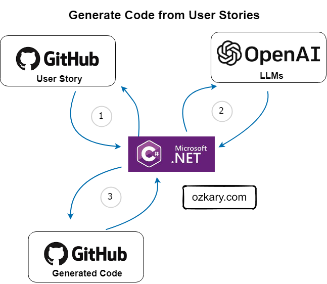

# Azure OpenAI Service .NET

The OpenAI Service is a cloud-based API that provides access to Large Language Models (LLM) and Artificial Intelligence (AI) Capabilities. This API allows developers to leverage the LLM models to create AI application that can perform Natural Language Processing (NLP) tasks such as text generation, code generation, language translation and others.

Azure provides the Azure OpenAI services which integrates the OpenAI API in Azure infrastructure. This enables us to create custom hosting resources and access the OpenAI API with a custom domain and deployment configuration. To access the Azure OpenAI API using .NET, we need to use the  OpenAI .NET client library and access an OpenAI resource in Azure.

> 👍 There are also OpenAI client libraries in Python, JavaScript, .NET

 

## Install the OpenAI dependencies adding a package

```
$ dotnet add package Azure.AI.OpenAI --prerelease
```

## Install the OpenAI dependencies restoring the project file from this project

```
$ cd csharp/CodeGeneration
# dotnet restore
```

## Add the Azure OpenAI environment configurations

Get the following configuration information:

> 👍 This example uses a custom Azure OpenAI resource.

- GitHub Repo API Token with write permissions to push comments to an issue
- Get an OpenAI API key
- If you are using an Azure OpenAI resource, get your custom end-point and deployment
  - The deployment should have the code-davinci-002 model

Set the linux environment variables with these commands:

```
$ echo export AZURE_OpenAI_KEY="OpenAI-key-here" >> ~/.bashrc && source ~/.bashrc
$ echo export GITHUB_TOKEN="github-key-here" >> ~/.bashrc && source ~/.bashrc
$ echo export AZURE_OpenAI_DEPLOYMENT="deployment-name" >> ~/.bashrc && source ~/.bashrc
$ echo export AZURE_OpenAI_ENDPOINT="https://YOUR-END-POINT.OpenAI.azure.com/" >> ~/.bashrc && source ~/.bashrc

```

## Build and Run the Code

```
$ dotnet build
$ dotnet run
```
### Describe the code

The code should run this workflow:

- Get a list of open GitHub issues with the label user-story
- Each issue content is sent to the OpenAI API to generate the code
- The generated code is posted as a comment on the user-story for the developers to review
  
> 👍 The following code uses a simple API call implementation for the GitHub and OpenAI APIs. Use the code from this repo: - [LLM Code Generation](https://github.com/ozkary/ai-engineering/tree/main/csharp/CodeGeneration)

```csharp
    // Get environment variables
    private static readonly string openaiApiKey = Environment.GetEnvironmentVariable("AZURE_OPENAI_KEY") ?? String.Empty;    
    private static readonly string openaiBase = Environment.GetEnvironmentVariable("AZURE_OPENAI_ENDPOINT") ?? String.Empty;       
    private static readonly string openaiEngine = Environment.GetEnvironmentVariable("AZURE_OPENAI_DEPLOYMENT") ?? String.Empty;           

    // GitHub API endpoint and authentication headers    
    private static readonly string githubToken = Environment.GetEnvironmentVariable("GITHUB_TOKEN") ?? String.Empty;

    /// <summary>
    /// Process a GitHub issue by label.
    /// </summary>
    public static async Task ProcessIssueByLabel(string repo, string label)
    {
        try
        {
            // Get the issues from the repo
            var @params = new Parameter { Label = label, State = "open" };              
            List<Issue> issues = await GitHubService.GetIssues(repo, @params, githubToken);
            if (issues != null)
            {
                foreach (var issue in issues)
                {
                    // Generate code using OpenAI
                    Console.WriteLine($"Generating code from GitHub issue: {issue.title} to {openaiBase}");
                    OpenAIService openaiService = new OpenAIService(openaiApiKey, openaiBase, openaiEngine);
                    string generatedCode = await openaiService.Create(issue.body ?? String.Empty);

                    if (!string.IsNullOrEmpty(generatedCode))
                    {
                        // Post a comment with the generated code to the GitHub issue
                        string comment = $"Generated code:\n\n```{generatedCode}\n```";
                        bool commentPosted = await GitHubService.PostIssueComment(repo, issue.number, comment, githubToken);

                        if (commentPosted)
                        {
                            Console.WriteLine("Code generated and posted as a comment on the GitHub issue.");
                        }
                        else
                        {
                            Console.WriteLine("Failed to post the comment on the GitHub issue.");
                        }
                    }
                    else
                    {
                        Console.WriteLine("Failed to generate code from the GitHub issue.");
                    }
                }
            }
            else
            {
                Console.WriteLine("Failed to retrieve the GitHub issue.");
            }
        }
        catch (Exception ex)
        {
            Console.WriteLine($"Error: {ex.Message}");
        }
    }

```

The OpenAI service class handles the OpenAI API details. It takes default parameters for the model deployment (engine), temperature and token limits, which control the cost and amount of text (roughly four letters per token) that should be allowed. For this service, we use the "Completion" model which allows developers to interact with OpenAI's language models and generate text-based completions.

```csharp

internal class OpenAIService
    {
        private string apiKey;
        private string engine;
        private string endPoint;
        private float temperature;
        private int maxTokens;
        private int n;
        private string stop;

        /// <summary>
        /// OpenAI client
        /// </summary>
        private OpenAIClient? client;

        public OpenAIService(string apiKey, string endPoint, string engine = "text-davinci-003", float temperature = 0.5f, int maxTokens = 350, int n = 1, string stop = "")
        {
            // Configure the OpenAI client with your API key and endpoint                 
            client = new OpenAIClient(new Uri(endPoint), new AzureKeyCredential(apiKey));
            this.apiKey = apiKey;
            this.endPoint = endPoint;            
            this.engine = engine;
            this.temperature = temperature;
            this.maxTokens = maxTokens;
            this.n = n;
            this.stop = stop;                
        }

        /// <summary>
        /// Create a completion from a prompt
        /// </summary>
        public async Task<string> Create(string prompt)
        {     
            var result = String.Empty;

            if (!String.IsNullOrEmpty(prompt) && client != null)
            {
                              
                Response<Completions> completionsResponse = await client.GetCompletionsAsync(engine, prompt);
                
                Console.WriteLine(completionsResponse);
                result = completionsResponse.Value.Choices[0].Text.Trim();                
                Console.WriteLine(result);
            }

            return result;            
        }
    }

```

## Run the code

After configuring your environment and downloading the code, we can run the code from a terminal by typing the following command from the project folder:

> 👍 Make sure to enter your repo name and label your issues with either user-story or any other label you would rather use.

```
# dotnet run --repo ozkary/ai-engineering --label user-story
```

After running the code successfully, we should be able to see the generated code as a comment on the GitHub issue.
