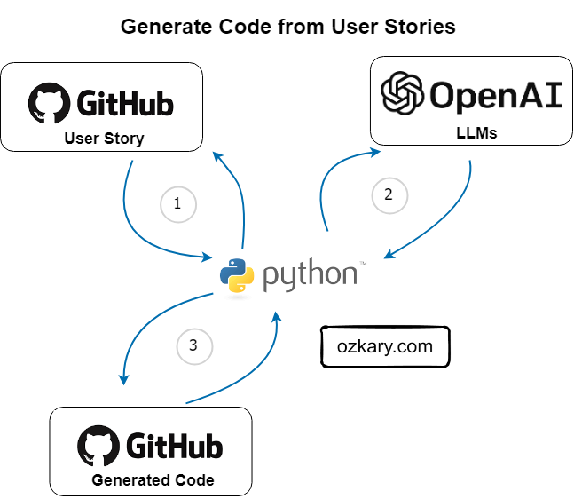

# LLM Models and code generation

Large Language Model (LLM) refers to a class of AI models that are designed to understand and generate human-like text based on large amounts of training data. LLM can play a significant role when it comes to generating code by leveraging the language understanding and generative capabilities. Users can simply create text prompts with a user story format and provide enough context like technologies, requirements, and technical specifications, and the LLM model can generate code snippets to match what is requested by the prompt. 

 


## Generate code from user stories

In the Agile development methodology, user stories are used to capture requirements or a feature from the perspective of end user or customer. For code generation, developers can write user stories to capture the context, requirements and technical specification necessary to generate code. This user story can then be processed by the LLM models to generate the code. As an example, a user store could be written in this way:

```

As a data scientist, I want to generate code using the following technologies, requirements, and specifications:

Technologies: 
- Python

Requirements:
- Transform a data frame by consolidating the 'date' and 'time' columns into a date time field column named 'created'.

Specifications:
- Create a function with the name 'transform_data'
- Use pandas to perform the data transformation
- Load the data from a parameter with the CSV file path
- Save the resulting data frame to disk in Parquet format
- Return true if successful or false if is not
- For coding standards, use the guidelines outlined in the [PEP 8 style guide for Python](https://www.python.org/dev/peps/pep-0008/).
- Create a unit test for the `transform_data` function to verify its correctness. The unit test should cover different scenarios and assert the expected behavior of the function.

```

From this user story, we can see that the end user of the story is a data scientist who would like to generate Python code. The requirement is basically to transform two columns from a data frame into a date-time column. There is also additional technical specification written that provides more context to the AI model, so it is able to generate the code with the specifics including what coding standards to use. 

Let's take a look a python example to see how we can generate code from a user story:

### Install the OpenAI dependencies

```
$ pip install OpenAI
```

### Add the OpenAI environment configurations

Get the following configuration information:

> 👍 This example can run directly on the OpenAI APIs or it can use a custom Azure OpenAI resource.

- GitHub Repo API Token with write permissions to push comments to an issue
- Get an OpenAI API key
- If you are using an Azure OpenAI resource, get your custom end-point and deployment
  - The deployment should have the code-davinci-002 model

Set the linux environment variables with these commands:

```
$ echo export AZURE_OpenAI_KEY="OpenAI-key-here" >> ~/.bashrc && source ~/.bashrc
$ echo export GITHUB_TOKEN="github-key-here" >> ~/.bashrc && source ~/.bashrc

# only set these variables when using your Azure OpenAI resource

$ echo export AZURE_OpenAI_DEPLOYMENT="deployment-name" >> ~/.bashrc && source ~/.bashrc
$ echo export AZURE_OpenAI_ENDPOINT="https://YOUR-END-POINT.OpenAI.azure.com/" >> ~/.bashrc && source ~/.bashrc

```
### Describe the code

The code should run this workflow:

- Get a list of open GitHub issues with the label user-story
- Each issue content is sent to the OpenAI API to generate the code
- The generated code is posted as a comment on the user-story for the developers to review
  
> 👍 The following code uses a simple API call implementation for the GitHub and OpenAI APIs. Use the code from this repo: - [LLM Code Generation](https://github.com/ozkary/ai-engineering/tree/main/python/code_generation)

```

def process_issue_by_label(repo: str, label: str):
    
    try:    
        # get the issues from the repo
        issues = GitHubService.get_issues(repo=repo, label=label, access_token=github_token)
        if issues is not None:
            
            for issue in issues:                                
                # Generate code using OpenAI            
                print(f'Generating code from GitHub issue: {issue.title}')
                openai_service = OpenAIService(api_key=openai_api_key, engine=openai_api_deployment, end_point=openai_api_base)
                generated_code = openai_service.create(issue.body)
                
                if generated_code is not None:            
                    # Post a comment with the generated code to the GitHub issue
                    comment = f'Generated code:\n\n```{generated_code}\n```'                    
                    comment_posted = GitHubService.post_issue_comment(repo,  issue.id, comment, access_token=github_token)
                    
                    if comment_posted:
                        print('Code generated and posted as a comment on the GitHub issue.')
                    else:
                        print('Failed to post the comment on the GitHub issue.')
                else:
                    print('Failed to generate code from the GitHub issue.')
        else:
            print('Failed to retrieve the GitHub issue.')
    except Exception as ex:
        print(f"Error:  {ex}")

```

The OpenAI service handles the API details. It takes default parameters for the model (engine), temperature and token limits, which control the cost and amount of text (roughly four letters per token) that should be allowed. For this service, we use the "Completion" model which allows developers to interact with OpenAI's language models and generate text-based completions.

Other parameters include:

- Temperature: Controls the randomness of the model's output. Higher values like 0.8 make the output more diverse and creative, while lower values like 0.2 make it more focused and deterministic.

- Max Tokens: Specifies the maximum length of the response generated by the model, measured in tokens. It helps to limit the length of the output and prevent excessively long responses.

- Top-p (Nucleus) Sampling: Also known as "P-Top" or "Nucleus Sampling," this parameter determines the probability distribution of the next token based on the likelihood of the most likely tokens. It helps in controlling the diversity of the generated output.

- Frequency Penalty: A parameter used to discourage repetitive or redundant responses by penalizing the model for repeating the same tokens too often.

- Presence Penalty: Used to encourage the model to generate responses that include all the provided information. A higher presence penalty value, such as 0.6, can help in ensuring more accurate and relevant responses.

- Stop Sequences: Optional tokens or phrases that can be specified to guide the model to stop generating output. It can be used to control the length of the response or prevent the model from continuing beyond a certain point.

```
class OpenAIService:
    def __init__(self, api_key: str, engine: str = 'code-davinci-002', end_point: str = None, temperature: float = 0.5, max_tokens: int = 350, n: int = 1, stop: str = None):
        openai.api_key = api_key

        # Azure OpenAI API custom resource
        # Use these settings only when using a custom endpoint like https://ozkary.openai.azure.com        
        if end_point is not None:
            openai.api_base = end_point                  
            openai.api_type = 'azure'
            openai.api_version = '2023-05-15' # this will change as the API evolves

        self.engine = engine
        self.temperature = temperature
        self.max_tokens = max_tokens
        self.n = n
        self.stop = stop
        
    def create(self, prompt: str) -> str:
        """Create a completion using the OpenAI API."""
                
        response = openai.Completion.create(
            engine=self.engine,
            prompt=prompt,
            max_tokens=self.max_tokens,
            n=self.n,
            stop=self.stop,
            temperature=self.temperature
        )

        print(response)       
        return response.choices[0].text.strip()

```

### Run the code

After configuring your environment and downloading the code, we can run the code from a terminal by typing the following command:

> 👍 Make sure to enter your repo name and label your issues with either user-story or any other label you would rather use.

```
# python3 gen_code_from_issue.py --repo ozkary/ai-engineering --label user-story
```

After running the code successfully, we should be able to see the generated code as a comment on the GitHub issue.
